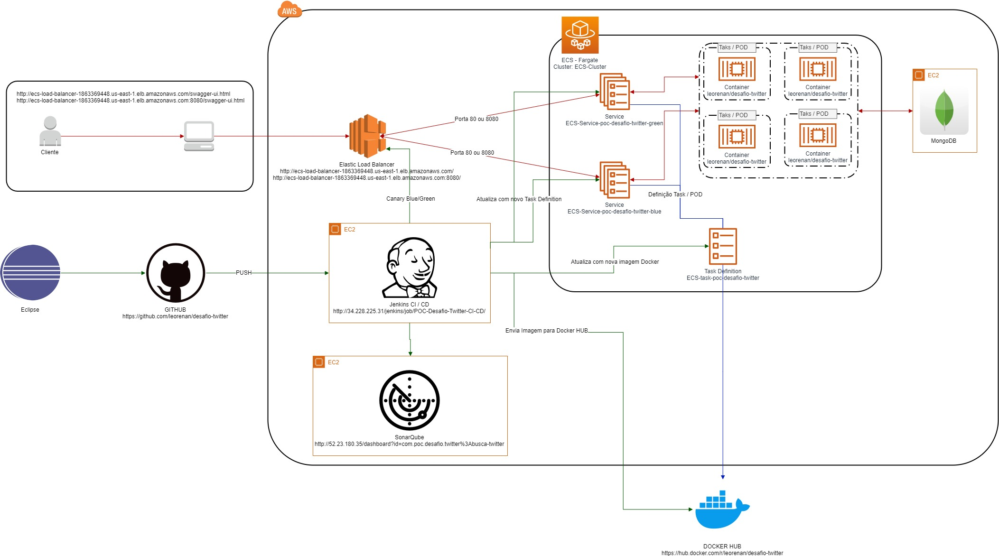
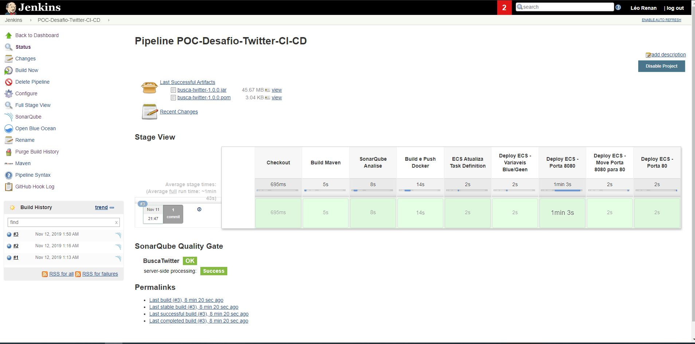

---
# Twitter API
----
API que onde realiza a busca por hashtag e posteiormente possibilita saber o top 5 usuários com mais seguidores.

---
# Funcionalidades 
---
   - **Busca Hashtag:** Ao passar uma lista de hashtags será buscado no Twitter e armazenado no banco de dados.
   - **Top 5 Usuários:** Após realizar a busca utilizando a lista de Hashtag, esta funcionalidade retorna o 5 usuários com mais seguidores encontrados no banco de dados.
---
# Tecnologias utilizadas 
---
 Tecnologias utilizadas para atender as necessidades.
 
 - **IDE:** Eclipse 2019-09 R (4.13.0)
  - **Repositorio:** GITHUB
 - **Liguagem de programação:** Java 8
 - **Framework:** 
- - Spring-Boot 2.1.3
- - Spring-Data 2.1.3
- - Lombok 1.2.3
 - - Swagger 2
 - - Maven 3.6.2
 -  **Qualidade código:** SonarQube 8.0 Community  
  - **Repositorio de imagens Docker:** Docker HUB
 - **Ambiente de nuvem:** AWS
 - - AWS ECS (Elastic Container Service)
 - - AWS Fargate
 - - AWS ELB (Elastic Load Balancer)
 - - AWS EC2 (Elastic Compute Cloud)
 - - AWS CLI (Gerenciado de linha de comando)  1.16.278 
 - **Camada de persistencia de dados:** MongoDB 4.2.1 Community
 - **CI / CD:** Jenkins 2.190.2
 - **Outros:**
 - -  Docker 19.03.4
 - - jq 1.5.1
 - - MongoDB Compass Community
 - - Postman

---
# Diagrama de Arquitetura
---

---
# Fluxo de execução
---
Quando o desenvolvedor efetua o push (poderia ser outros eventos como: merge request e o mais adequado), o GITHUB aciona o Jenkins.
O Jenkins por sua vez executa os seguintes passos: 



- Faz o checkout do projeto; 
- Compila utilizando o maven;
-Validação de qualidade do código com o SonarQube;
- Compila a aplicação em uma imagem Docker
- Envia a imagem para o Docker HUB
- Atualiza a Task Definition no ECS
- Executa o deploy do container primeiramente em uma porta não utilizada (8080), asim possibilita utilizar a  deployment canary blue/green
- Depois de finalizado o deploys é alterado a porta 8080 para 80
- Executa o deploy  do container na antiga porta 80, para que fique todo ambiente equalizado.

---

# Melhorias
---
Este projeto tem como roadmap de melhorias os seguintes topicos:
- Contruir camada de teste unitario e garantir a cobertura de minimo de 80%
- Realizar Smoke Test e Acceptance Test podendo ser realizados com as ferramentas KarateDSL e/ou Selenium
- Teste de carga com JMeter


---

# Links Uteis
---
 GIT HUB
 
 ``` 
    https://github.com/leorenan/desafio-twitter
```
 Docker HUB
 
 ``` 
   https://hub.docker.com/r/leorenan/desafio-twitter
```
 SonarQube
 
 ``` 
   http://52.23.180.35/dashboard?id=br.com.desafio.leorenanr%3Abusca-twitter
```
 Documentação Swagger para realizar os testes ambiente blue
 
 ``` 
    http://ecs-load-balancer-1863369448.us-east-1.elb.amazonaws.com/swagger-ui.html
```
 Documentação Swagger para realizar os testes ambiente green
 
 ``` 
    http://ecs-load-balancer-1863369448.us-east-1.elb.amazonaws.com:8080/swagger-ui.html
```
 Documentação Swagger para realizar os testes ambiente green
 
 ``` 
    http://ecs-load-balancer-1863369448.us-east-1.elb.amazonaws.com:8080/swagger-ui.html
```
---
# Descrição da API
---
 Essas API tem a capacidade de escalar automaticamente conforme a quantidade de requisições relaizadas
 
 Documentação Swagger para realizar os testes
 
 ``` 
    http://ecs-load-balancer-1863369448.us-east-1.elb.amazonaws.com/swagger-ui.html
```
 
 Para utilizar a API é muito simples. Basta utilizar as sequintes intruções
 
API de Busca Hashtags
``` 
    http://ecs-load-balancer-1863369448.us-east-1.elb.amazonaws.com/api/v1/twitts/hashtag
```

 API 5 Top usuarios seguidores
``` 
    http://ecs-load-balancer-1863369448.us-east-1.elb.amazonaws.com/usuarios/top-5-seguidores
```

 ##### EXEMPLO BUSCA HASHTAG
 
**Request** Busca Hashtags
```
    GET: /api/v1/twitts/hashtag?hashtags=aws
    Host: http://ecs-load-balancer-1863369448.us-east-1.elb.amazonaws.com
    Content-Type: application/json
    Cache-Control: no-cache
```

 **Response**
```
    Status Code: 200
    Body:
        {
  "status": "OK",
  "payload": [
    {
      "id": "5dca14cbf8236900010ae265",
      "hashtagNome": [
        "WePowerTech",
        "aws",
        "reInvent"
      ],
      "mensagem": "RT @Werner: Join the first #WePowerTech Diversity Series at #aws #reInvent 2017 https://t.co/LeNXeEpLT8 https://t.co/jlt2nJE7pd",
      "usuarioNome": "Hiro @ 運転出来ない田舎住まい",
      "usuarioQuantidadeSeguidores": 5193,
      "jsonRetornoTwitter": "{\"created_at\":\"Tue Nov 12 02:07:45 +0000 2019\",\"id\":1194074269715701761,\"id_str\":\"1194074269715701761\",\"text\":\"RT @Werner: Join the first #WePowerTech Diversity Series at #aws #reInvent 2017 https://t.co/LeNXeEpLT8 https://t.co/jlt2nJE7pd\",\"truncated\":false,\"entities\":{\"hashtags\":[{\"text\":\"WePowerTech\",\"indices\":[27,39]},{\"text\":\"aws\",\"indices\":[60,64]},{\"text\":\"reInvent\",\"indices\":[65,74]}],\"symbols\":[],\"user_mentions\":[{\"screen_name\":\"Werner\",\"name\":\"Werner Vogels\",\"id\":113963,\"id_str\":\"113963\",\"indices\":[3,10]}],\"urls\":[{\"url\":\"https://t.co/LeNXeEpLT8\",\"expanded_url\":\"https://reinvent.awsevents.com/learn/diversity/\",\"display_url\":\"reinvent.awsevents.com/learn/diversit…\",\"indices\":[80,103]}]},\"metadata\":{\"iso_language_code\":\"en\",\"result_type\":\"recent\"},\"source\":\"\\u003ca href\\u003d\\\"http://twitter.com/download/android\\\" rel\\u003d\\\"nofollow\\\"\\u003eTwitter for Android\\u003c/a\\u003e\",\"user\":{\"id\":2402374440,\"id_str\":\"2402374440\",\"name\":\"Hiro @ 運転出来ない田舎住まい\",\"screen_name\":\"hirokonishimura\",\"location\":\"京都 ⛩️→MD 🦀→NYC 🗽→DC ☁️ \",\"description\":\"Founder @awsnewbies ☁️ Instructor @LinkedIn 🎓 Technical Writer @24villages ✍️ 日系一世 🇯🇵 @SiaMiaCat Mom 🐱 Need a Writer? ➡️ https://t.co/volv5GTQwE\",\"url\":\"https://t.co/kn3EAoopMs\",\"entities\":{\"url\":{\"urls\":[{\"url\":\"https://t.co/kn3EAoopMs\",\"expanded_url\":\"https://introtoaws.com\",\"display_url\":\"introtoaws.com\",\"indices\":[0,23]}]},\"description\":{\"urls\":[{}]}},\"protectedJson\":false,\"followers_count\":5193,\"friends_count\":1181,\"listed_count\":103,\"created_at\":\"Sat Mar 22 00:52:04 +0000 2014\",\"favourites_count\":14994,\"geo_enabled\":true,\"verified\":false,\"statuses_count\":30237,\"contributors_enabled\":false,\"is_translator\":false,\"is_translation_enabled\":false,\"profile_background_color\":\"ACDED6\",\"profile_background_image_url\":\"http://abs.twimg.com/images/themes/theme18/bg.gif\",\"profile_background_image_url_https\":\"https://abs.twimg.com/images/themes/theme18/bg.gif\",\"profile_background_tile\":false,\"profile_image_url\":\"http://pbs.twimg.com/profile_images/1187865609675120640/uNhwLncc_normal.jpg\",\"profile_image_url_https\":\"https://pbs.twimg.com/profile_images/1187865609675120640/uNhwLncc_normal.jpg\",\"profile_banner_url\":\"https://pbs.twimg.com/profile_banners/2402374440/1572098129\",\"profile_link_color\":\"038543\",\"profile_sidebar_border_color\":\"EEEEEE\",\"profile_sidebar_fill_color\":\"F6F6F6\",\"profile_text_color\":\"333333\",\"profile_use_background_image\":true,\"has_extended_profile\":false,\"default_profile\":false,\"default_profile_image\":false,\"translator_type\":\"none\"},\"retweeted_status\":{\"created_at\":\"Fri Oct 20 13:44:57 +0000 2017\",\"id\":921371665275092992,\"id_str\":\"921371665275092992\",\"text\":\"Join the first #WePowerTech Diversity Series at #aws #reInvent 2017 https://t.co/LeNXeEpLT8 https://t.co/jlt2nJE7pd\",\"truncated\":false,\"entities\":{\"hashtags\":[{\"text\":\"WePowerTech\",\"indices\":[15,27]},{\"text\":\"aws\",\"indices\":[48,52]},{\"text\":\"reInvent\",\"indices\":[53,62]}],\"symbols\":[],\"user_mentions\":[],\"urls\":[{\"url\":\"https://t.co/LeNXeEpLT8\",\"expanded_url\":\"https://reinvent.awsevents.com/learn/diversity/\",\"display_url\":\"reinvent.awsevents.com/learn/diversit…\",\"indices\":[68,91]}]},\"metadata\":{\"iso_language_code\":\"en\",\"result_type\":\"recent\"},\"source\":\"\\u003ca href\\u003d\\\"http://twitter.com\\\" rel\\u003d\\\"nofollow\\\"\\u003eTwitter Web Client\\u003c/a\\u003e\",\"user\":{\"id\":113963,\"id_str\":\"113963\",\"name\":\"Werner Vogels\",\"screen_name\":\"Werner\",\"location\":\"Seattle, WA\",\"description\":\"CTO @ Amazon\",\"url\":\"http://t.co/XJnom3L170\",\"entities\":{\"url\":{\"urls\":[{\"url\":\"http://t.co/XJnom3L170\",\"expanded_url\":\"http://smile.amazon.com\",\"display_url\":\"smile.amazon.com\",\"indices\":[0,22]}]},\"description\":{\"urls\":[]}},\"protectedJson\":false,\"followers_count\":298923,\"friends_count\":177,\"listed_count\":4555,\"created_at\":\"Thu Dec 21 15:12:02 +0000 2006\",\"favourites_count\":1583,\"geo_enabled\":true,\"verified\":true,\"statuses_count\":10534,\"contributors_enabled\":false,\"is_translator\":false,\"is_translation_enabled\":true,\"profile_background_color\":\"FFFFFF\",\"profile_background_image_url\":\"http://abs.twimg.com/images/themes/theme1/bg.png\",\"profile_background_image_url_https\":\"https://abs.twimg.com/images/themes/theme1/bg.png\",\"profile_background_tile\":false,\"profile_image_url\":\"http://pbs.twimg.com/profile_images/563188960394891264/z3-Rh11q_normal.jpeg\",\"profile_image_url_https\":\"https://pbs.twimg.com/profile_images/563188960394891264/z3-Rh11q_normal.jpeg\",\"profile_banner_url\":\"https://pbs.twimg.com/profile_banners/113963/1393564200\",\"profile_link_color\":\"232D41\",\"profile_sidebar_border_color\":\"FFFFFF\",\"profile_sidebar_fill_color\":\"FFFFFF\",\"profile_text_color\":\"2C2C2C\",\"profile_use_background_image\":false,\"has_extended_profile\":false,\"default_profile\":false,\"default_profile_image\":false,\"translator_type\":\"none\"},\"is_quote_status\":false,\"retweet_count\":26,\"favorite_count\":45,\"favorited\":false,\"retweeted\":false,\"possibly_sensitive\":false,\"lang\":\"en\"},\"is_quote_status\":false,\"retweet_count\":26,\"favorite_count\":0,\"favorited\":false,\"retweeted\":false,\"lang\":\"en\"}"
    },
    {
      "id": "5dca14cbf8236900010ae266",
      "hashtagNome": [
        "Iot",
        "TCNN",
        "Aws"
      ],
      "mensagem": "RT @TechCheckNN: Motherson Innovations to make ground comms modules for Myriota #Iot satellite network \nhttps://t.co/xYWOyqUCnL #TCNN #Aws…",
      "usuarioNome": "Intelligent Edge",
      "usuarioQuantidadeSeguidores": 2906,
      "jsonRetornoTwitter": "{\"created_at\":\"Tue Nov 12 02:07:17 +0000 2019\",\"id\":1194074150673014784,\"id_str\":\"1194074150673014784\",\"text\":\"RT @TechCheckNN: Motherson Innovations to make ground comms modules for Myriota #Iot satellite network \\nhttps://t.co/xYWOyqUCnL #TCNN #Aws…\",\"truncated\":false,\"entities\":{\"hashtags\":[{\"text\":\"Iot\",\"indices\":[80,84]},{\"text\":\"TCNN\",\"indices\":[128,133]},{\"text\":\"Aws\",\"indices\":[134,138]}],\"symbols\":[],\"user_mentions\":[{\"screen_name\":\"TechCheckNN\",\"name\":\"TechCheckNews\",\"id\":2234101452,\"id_str\":\"2234101452\",\"indices\":[3,15]}],\"urls\":[{\"url\":\"https://t.co/xYWOyqUCnL\",\"expanded_url\":\"http://po.st/ADQxNF\",\"display_url\":\"po.st/ADQxNF\",\"indices\":[104,127]}]},\"metadata\":{\"iso_language_code\":\"en\",\"result_type\":\"recent\"},\"source\":\"\\u003ca href\\u003d\\\"https://iotdatafusion.com\\\" rel\\u003d\\\"nofollow\\\"\\u003eIntelligent Edge Iot and AI Bot\\u003c/a\\u003e\",\"user\":{\"id\":1040351960757686274,\"id_str\":\"1040351960757686274\",\"name\":\"Intelligent Edge\",\"screen_name\":\"EdgeIotAi\",\"location\":\"Living On The Edge\",\"description\":\"The EDGE, where things happen... Follow us to keep up with the latest in Intelligent EDGE tech. Tweeting about EDGE #IoT \\u0026 #AI\",\"entities\":{\"description\":{\"urls\":[]}},\"protectedJson\":false,\"followers_count\":2906,\"friends_count\":4853,\"listed_count\":75,\"created_at\":\"Thu Sep 13 21:30:11 +0000 2018\",\"favourites_count\":101,\"geo_enabled\":false,\"verified\":false,\"statuses_count\":45848,\"contributors_enabled\":false,\"is_translator\":false,\"is_translation_enabled\":false,\"profile_background_color\":\"000000\",\"profile_background_image_url\":\"http://abs.twimg.com/images/themes/theme1/bg.png\",\"profile_background_image_url_https\":\"https://abs.twimg.com/images/themes/theme1/bg.png\",\"profile_background_tile\":false,\"profile_image_url\":\"http://pbs.twimg.com/profile_images/1040573396398956544/BetojiRw_normal.jpg\",\"profile_image_url_https\":\"https://pbs.twimg.com/profile_images/1040573396398956544/BetojiRw_normal.jpg\",\"profile_banner_url\":\"https://pbs.twimg.com/profile_banners/1040351960757686274/1536926943\",\"profile_link_color\":\"1B95E0\",\"profile_sidebar_border_color\":\"000000\",\"profile_sidebar_fill_color\":\"000000\",\"profile_text_color\":\"000000\",\"profile_use_background_image\":false,\"has_extended_profile\":false,\"default_profile\":false,\"default_profile_image\":false,\"translator_type\":\"none\"},\"retweeted_status\":{\"created_at\":\"Tue Nov 12 01:52:17 +0000 2019\",\"id\":1194070377904914433,\"id_str\":\"1194070377904914433\",\"text\":\"Motherson Innovations to make ground comms modules for Myriota #Iot satellite network \\nhttps://t.co/xYWOyqUCnL… https://t.co/2BgxmO0XX3\",\"truncated\":true,\"entities\":{\"hashtags\":[{\"text\":\"Iot\",\"indices\":[63,67]}],\"symbols\":[],\"user_mentions\":[],\"urls\":[{\"url\":\"https://t.co/xYWOyqUCnL\",\"expanded_url\":\"http://po.st/ADQxNF\",\"display_url\":\"po.st/ADQxNF\",\"indices\":[87,110]},{\"url\":\"https://t.co/2BgxmO0XX3\",\"expanded_url\":\"https://twitter.com/i/web/status/1194070377904914433\",\"display_url\":\"twitter.com/i/web/status/1…\",\"indices\":[112,135]}]},\"metadata\":{\"iso_language_code\":\"en\",\"result_type\":\"recent\"},\"source\":\"\\u003ca href\\u003d\\\"http://techchecknews.com\\\" rel\\u003d\\\"nofollow\\\"\\u003eSnapAutoPostingTCNN\\u003c/a\\u003e\",\"user\":{\"id\":2234101452,\"id_str\":\"2234101452\",\"name\":\"TechCheckNews\",\"screen_name\":\"TechCheckNN\",\"location\":\"Minneapolis, MN\",\"description\":\"Top sourced Science,Technology, Engineering, and Math content curation. Owned and operated by @embeddednature\",\"url\":\"https://t.co/FwghygSmLq\",\"entities\":{\"url\":{\"urls\":[{\"url\":\"https://t.co/FwghygSmLq\",\"expanded_url\":\"http://techchecknews.com\",\"display_url\":\"techchecknews.com\",\"indices\":[0,23]}]},\"description\":{\"urls\":[]}},\"protectedJson\":false,\"followers_count\":5798,\"friends_count\":5907,\"listed_count\":145,\"created_at\":\"Sat Dec 07 06:57:28 +0000 2013\",\"favourites_count\":367,\"geo_enabled\":false,\"verified\":false,\"statuses_count\":28597,\"contributors_enabled\":false,\"is_translator\":false,\"is_translation_enabled\":false,\"profile_background_color\":\"2286F0\",\"profile_background_image_url\":\"http://abs.twimg.com/images/themes/theme1/bg.png\",\"profile_background_image_url_https\":\"https://abs.twimg.com/images/themes/theme1/bg.png\",\"profile_background_tile\":false,\"profile_image_url\":\"http://pbs.twimg.com/profile_images/788375152677486592/DUSWzv8u_normal.jpg\",\"profile_image_url_https\":\"https://pbs.twimg.com/profile_images/788375152677486592/DUSWzv8u_normal.jpg\",\"profile_banner_url\":\"https://pbs.twimg.com/profile_banners/2234101452/1507405787\",\"profile_link_color\":\"1B95E0\",\"profile_sidebar_border_color\":\"000000\",\"profile_sidebar_fill_color\":\"DDEEF6\",\"profile_text_color\":\"333333\",\"profile_use_background_image\":true,\"has_extended_profile\":true,\"default_profile\":false,\"default_profile_image\":false,\"translator_type\":\"none\"},\"is_quote_status\":false,\"retweet_count\":1,\"favorite_count\":0,\"favorited\":false,\"retweeted\":false,\"possibly_sensitive\":false,\"lang\":\"en\"},\"is_quote_status\":false,\"retweet_count\":1,\"favorite_count\":0,\"favorited\":false,\"retweeted\":false,\"lang\":\"en\"}"
    }
  ]
}
```
     
 ##### EXEMPLO USUARIO TOP 5 SEGUIDORES
 **Request**
```
       GET: /api/v1/usuarios/top-5-seguidores
    Host: http://ecs-load-balancer-1863369448.us-east-1.elb.amazonaws.com
    Content-Type: application/json
    Cache-Control: no-cache
```

 **Response**
```
    Status Code: 200
    Body:
        {
  "status": "OK",
  "payload": [
    {
      "id": "5dca14bcfef719699046f3a4",
      "hashtagNome": [
        "Splunk",
        "AWS",
        "BigData"
      ],
      "mensagem": "Which service is optimal for Splunk docker in AWS\nhttps://t.co/CMnC76zJnb #Splunk #AWS #BigData",
      "usuarioNome": "Splunk Answers",
      "usuarioQuantidadeSeguidores": 6226,
      "jsonRetornoTwitter": "{\"created_at\":\"Tue Nov 12 02:00:00 +0000 2019\",\"id\":1194072321281146880,\"id_str\":\"1194072321281146880\",\"text\":\"Which service is optimal for Splunk docker in AWS\\nhttps://t.co/CMnC76zJnb #Splunk #AWS #BigData\",\"truncated\":false,\"entities\":{\"hashtags\":[{\"text\":\"Splunk\",\"indices\":[74,81]},{\"text\":\"AWS\",\"indices\":[82,86]},{\"text\":\"BigData\",\"indices\":[87,95]}],\"symbols\":[],\"user_mentions\":[],\"urls\":[{\"url\":\"https://t.co/CMnC76zJnb\",\"expanded_url\":\"https://splk.it/36PgMJX\",\"display_url\":\"splk.it/36PgMJX\",\"indices\":[50,73]}]},\"metadata\":{\"iso_language_code\":\"en\",\"result_type\":\"recent\"},\"source\":\"\\u003ca href\\u003d\\\"https://www.sprinklr.com\\\" rel\\u003d\\\"nofollow\\\"\\u003eSprinklr\\u003c/a\\u003e\",\"user\":{\"id\":121214676,\"id_str\":\"121214676\",\"name\":\"Splunk Answers\",\"screen_name\":\"splunkanswers\",\"location\":\"San Francisco, CA\",\"description\":\"Check out tweets of answers contributed by awesome members of the Splunk Community, or visit https://t.co/CC2uBVKQ7Q for answers to your own Splunk questions!\",\"url\":\"http://t.co/eHyF0iwWdR\",\"entities\":{\"url\":{\"urls\":[{\"url\":\"http://t.co/eHyF0iwWdR\",\"expanded_url\":\"http://answers.splunk.com/\",\"display_url\":\"answers.splunk.com\",\"indices\":[0,22]}]},\"description\":{\"urls\":[{}]}},\"protectedJson\":false,\"followers_count\":6226,\"friends_count\":41,\"listed_count\":138,\"created_at\":\"Mon Mar 08 20:09:54 +0000 2010\",\"favourites_count\":267,\"geo_enabled\":true,\"verified\":false,\"statuses_count\":82704,\"contributors_enabled\":false,\"is_translator\":false,\"is_translation_enabled\":false,\"profile_background_color\":\"C0DEED\",\"profile_background_image_url\":\"http://abs.twimg.com/images/themes/theme1/bg.png\",\"profile_background_image_url_https\":\"https://abs.twimg.com/images/themes/theme1/bg.png\",\"profile_background_tile\":false,\"profile_image_url\":\"http://pbs.twimg.com/profile_images/1174294501633871872/AAK0906G_normal.jpg\",\"profile_image_url_https\":\"https://pbs.twimg.com/profile_images/1174294501633871872/AAK0906G_normal.jpg\",\"profile_banner_url\":\"https://pbs.twimg.com/profile_banners/121214676/1568808601\",\"profile_link_color\":\"1DA1F2\",\"profile_sidebar_border_color\":\"C0DEED\",\"profile_sidebar_fill_color\":\"DDEEF6\",\"profile_text_color\":\"333333\",\"profile_use_background_image\":true,\"has_extended_profile\":false,\"default_profile\":true,\"default_profile_image\":false,\"translator_type\":\"none\"},\"is_quote_status\":false,\"retweet_count\":0,\"favorite_count\":1,\"favorited\":false,\"retweeted\":false,\"lang\":\"en\"}"
    },
    {
      "id": "5dca14cbf8236900010ae269",
      "hashtagNome": [
        "Splunk",
        "AWS",
        "BigData"
      ],
      "mensagem": "Which service is optimal for Splunk docker in AWS\nhttps://t.co/CMnC76zJnb #Splunk #AWS #BigData",
      "usuarioNome": "Splunk Answers",
      "usuarioQuantidadeSeguidores": 6226,
      "jsonRetornoTwitter": "{\"created_at\":\"Tue Nov 12 02:00:00 +0000 2019\",\"id\":1194072321281146880,\"id_str\":\"1194072321281146880\",\"text\":\"Which service is optimal for Splunk docker in AWS\\nhttps://t.co/CMnC76zJnb #Splunk #AWS #BigData\",\"truncated\":false,\"entities\":{\"hashtags\":[{\"text\":\"Splunk\",\"indices\":[74,81]},{\"text\":\"AWS\",\"indices\":[82,86]},{\"text\":\"BigData\",\"indices\":[87,95]}],\"symbols\":[],\"user_mentions\":[],\"urls\":[{\"url\":\"https://t.co/CMnC76zJnb\",\"expanded_url\":\"https://splk.it/36PgMJX\",\"display_url\":\"splk.it/36PgMJX\",\"indices\":[50,73]}]},\"metadata\":{\"iso_language_code\":\"en\",\"result_type\":\"recent\"},\"source\":\"\\u003ca href\\u003d\\\"https://www.sprinklr.com\\\" rel\\u003d\\\"nofollow\\\"\\u003eSprinklr\\u003c/a\\u003e\",\"user\":{\"id\":121214676,\"id_str\":\"121214676\",\"name\":\"Splunk Answers\",\"screen_name\":\"splunkanswers\",\"location\":\"San Francisco, CA\",\"description\":\"Check out tweets of answers contributed by awesome members of the Splunk Community, or visit https://t.co/CC2uBVKQ7Q for answers to your own Splunk questions!\",\"url\":\"http://t.co/eHyF0iwWdR\",\"entities\":{\"url\":{\"urls\":[{\"url\":\"http://t.co/eHyF0iwWdR\",\"expanded_url\":\"http://answers.splunk.com/\",\"display_url\":\"answers.splunk.com\",\"indices\":[0,22]}]},\"description\":{\"urls\":[{}]}},\"protectedJson\":false,\"followers_count\":6226,\"friends_count\":41,\"listed_count\":138,\"created_at\":\"Mon Mar 08 20:09:54 +0000 2010\",\"favourites_count\":267,\"geo_enabled\":true,\"verified\":false,\"statuses_count\":82704,\"contributors_enabled\":false,\"is_translator\":false,\"is_translation_enabled\":false,\"profile_background_color\":\"C0DEED\",\"profile_background_image_url\":\"http://abs.twimg.com/images/themes/theme1/bg.png\",\"profile_background_image_url_https\":\"https://abs.twimg.com/images/themes/theme1/bg.png\",\"profile_background_tile\":false,\"profile_image_url\":\"http://pbs.twimg.com/profile_images/1174294501633871872/AAK0906G_normal.jpg\",\"profile_image_url_https\":\"https://pbs.twimg.com/profile_images/1174294501633871872/AAK0906G_normal.jpg\",\"profile_banner_url\":\"https://pbs.twimg.com/profile_banners/121214676/1568808601\",\"profile_link_color\":\"1DA1F2\",\"profile_sidebar_border_color\":\"C0DEED\",\"profile_sidebar_fill_color\":\"DDEEF6\",\"profile_text_color\":\"333333\",\"profile_use_background_image\":true,\"has_extended_profile\":false,\"default_profile\":true,\"default_profile_image\":false,\"translator_type\":\"none\"},\"is_quote_status\":false,\"retweet_count\":0,\"favorite_count\":1,\"favorited\":false,\"retweeted\":false,\"lang\":\"en\"}"
    },
    {
      "id": "5dca14bcfef719699046f3a0",
      "hashtagNome": [
        "WePowerTech",
        "aws",
        "reInvent"
      ],
      "mensagem": "RT @Werner: Join the first #WePowerTech Diversity Series at #aws #reInvent 2017 https://t.co/LeNXeEpLT8 https://t.co/jlt2nJE7pd",
      "usuarioNome": "Hiro @ 運転出来ない田舎住まい",
      "usuarioQuantidadeSeguidores": 5193,
      "jsonRetornoTwitter": "{\"created_at\":\"Tue Nov 12 02:07:45 +0000 2019\",\"id\":1194074269715701761,\"id_str\":\"1194074269715701761\",\"text\":\"RT @Werner: Join the first #WePowerTech Diversity Series at #aws #reInvent 2017 https://t.co/LeNXeEpLT8 https://t.co/jlt2nJE7pd\",\"truncated\":false,\"entities\":{\"hashtags\":[{\"text\":\"WePowerTech\",\"indices\":[27,39]},{\"text\":\"aws\",\"indices\":[60,64]},{\"text\":\"reInvent\",\"indices\":[65,74]}],\"symbols\":[],\"user_mentions\":[{\"screen_name\":\"Werner\",\"name\":\"Werner Vogels\",\"id\":113963,\"id_str\":\"113963\",\"indices\":[3,10]}],\"urls\":[{\"url\":\"https://t.co/LeNXeEpLT8\",\"expanded_url\":\"https://reinvent.awsevents.com/learn/diversity/\",\"display_url\":\"reinvent.awsevents.com/learn/diversit…\",\"indices\":[80,103]}]},\"metadata\":{\"iso_language_code\":\"en\",\"result_type\":\"recent\"},\"source\":\"\\u003ca href\\u003d\\\"http://twitter.com/download/android\\\" rel\\u003d\\\"nofollow\\\"\\u003eTwitter for Android\\u003c/a\\u003e\",\"user\":{\"id\":2402374440,\"id_str\":\"2402374440\",\"name\":\"Hiro @ 運転出来ない田舎住まい\",\"screen_name\":\"hirokonishimura\",\"location\":\"京都 ⛩️→MD 🦀→NYC 🗽→DC ☁️ \",\"description\":\"Founder @awsnewbies ☁️ Instructor @LinkedIn 🎓 Technical Writer @24villages ✍️ 日系一世 🇯🇵 @SiaMiaCat Mom 🐱 Need a Writer? ➡️ https://t.co/volv5GTQwE\",\"url\":\"https://t.co/kn3EAoopMs\",\"entities\":{\"url\":{\"urls\":[{\"url\":\"https://t.co/kn3EAoopMs\",\"expanded_url\":\"https://introtoaws.com\",\"display_url\":\"introtoaws.com\",\"indices\":[0,23]}]},\"description\":{\"urls\":[{}]}},\"protectedJson\":false,\"followers_count\":5193,\"friends_count\":1181,\"listed_count\":103,\"created_at\":\"Sat Mar 22 00:52:04 +0000 2014\",\"favourites_count\":14994,\"geo_enabled\":true,\"verified\":false,\"statuses_count\":30236,\"contributors_enabled\":false,\"is_translator\":false,\"is_translation_enabled\":false,\"profile_background_color\":\"ACDED6\",\"profile_background_image_url\":\"http://abs.twimg.com/images/themes/theme18/bg.gif\",\"profile_background_image_url_https\":\"https://abs.twimg.com/images/themes/theme18/bg.gif\",\"profile_background_tile\":false,\"profile_image_url\":\"http://pbs.twimg.com/profile_images/1187865609675120640/uNhwLncc_normal.jpg\",\"profile_image_url_https\":\"https://pbs.twimg.com/profile_images/1187865609675120640/uNhwLncc_normal.jpg\",\"profile_banner_url\":\"https://pbs.twimg.com/profile_banners/2402374440/1572098129\",\"profile_link_color\":\"038543\",\"profile_sidebar_border_color\":\"EEEEEE\",\"profile_sidebar_fill_color\":\"F6F6F6\",\"profile_text_color\":\"333333\",\"profile_use_background_image\":true,\"has_extended_profile\":false,\"default_profile\":false,\"default_profile_image\":false,\"translator_type\":\"none\"},\"retweeted_status\":{\"created_at\":\"Fri Oct 20 13:44:57 +0000 2017\",\"id\":921371665275092992,\"id_str\":\"921371665275092992\",\"text\":\"Join the first #WePowerTech Diversity Series at #aws #reInvent 2017 https://t.co/LeNXeEpLT8 https://t.co/jlt2nJE7pd\",\"truncated\":false,\"entities\":{\"hashtags\":[{\"text\":\"WePowerTech\",\"indices\":[15,27]},{\"text\":\"aws\",\"indices\":[48,52]},{\"text\":\"reInvent\",\"indices\":[53,62]}],\"symbols\":[],\"user_mentions\":[],\"urls\":[{\"url\":\"https://t.co/LeNXeEpLT8\",\"expanded_url\":\"https://reinvent.awsevents.com/learn/diversity/\",\"display_url\":\"reinvent.awsevents.com/learn/diversit…\",\"indices\":[68,91]}]},\"metadata\":{\"iso_language_code\":\"en\",\"result_type\":\"recent\"},\"source\":\"\\u003ca href\\u003d\\\"http://twitter.com\\\" rel\\u003d\\\"nofollow\\\"\\u003eTwitter Web Client\\u003c/a\\u003e\",\"user\":{\"id\":113963,\"id_str\":\"113963\",\"name\":\"Werner Vogels\",\"screen_name\":\"Werner\",\"location\":\"Seattle, WA\",\"description\":\"CTO @ Amazon\",\"url\":\"http://t.co/XJnom3L170\",\"entities\":{\"url\":{\"urls\":[{\"url\":\"http://t.co/XJnom3L170\",\"expanded_url\":\"http://smile.amazon.com\",\"display_url\":\"smile.amazon.com\",\"indices\":[0,22]}]},\"description\":{\"urls\":[]}},\"protectedJson\":false,\"followers_count\":298923,\"friends_count\":177,\"listed_count\":4555,\"created_at\":\"Thu Dec 21 15:12:02 +0000 2006\",\"favourites_count\":1583,\"geo_enabled\":true,\"verified\":true,\"statuses_count\":10534,\"contributors_enabled\":false,\"is_translator\":false,\"is_translation_enabled\":true,\"profile_background_color\":\"FFFFFF\",\"profile_background_image_url\":\"http://abs.twimg.com/images/themes/theme1/bg.png\",\"profile_background_image_url_https\":\"https://abs.twimg.com/images/themes/theme1/bg.png\",\"profile_background_tile\":false,\"profile_image_url\":\"http://pbs.twimg.com/profile_images/563188960394891264/z3-Rh11q_normal.jpeg\",\"profile_image_url_https\":\"https://pbs.twimg.com/profile_images/563188960394891264/z3-Rh11q_normal.jpeg\",\"profile_banner_url\":\"https://pbs.twimg.com/profile_banners/113963/1393564200\",\"profile_link_color\":\"232D41\",\"profile_sidebar_border_color\":\"FFFFFF\",\"profile_sidebar_fill_color\":\"FFFFFF\",\"profile_text_color\":\"2C2C2C\",\"profile_use_background_image\":false,\"has_extended_profile\":false,\"default_profile\":false,\"default_profile_image\":false,\"translator_type\":\"none\"},\"is_quote_status\":false,\"retweet_count\":26,\"favorite_count\":45,\"favorited\":false,\"retweeted\":false,\"possibly_sensitive\":false,\"lang\":\"en\"},\"is_quote_status\":false,\"retweet_count\":26,\"favorite_count\":0,\"favorited\":false,\"retweeted\":false,\"lang\":\"en\"}"
    },
    {
      "id": "5dca14cbf8236900010ae265",
      "hashtagNome": [
        "WePowerTech",
        "aws",
        "reInvent"
      ],
      "mensagem": "RT @Werner: Join the first #WePowerTech Diversity Series at #aws #reInvent 2017 https://t.co/LeNXeEpLT8 https://t.co/jlt2nJE7pd",
      "usuarioNome": "Hiro @ 運転出来ない田舎住まい",
      "usuarioQuantidadeSeguidores": 5193,
      "jsonRetornoTwitter": "{\"created_at\":\"Tue Nov 12 02:07:45 +0000 2019\",\"id\":1194074269715701761,\"id_str\":\"1194074269715701761\",\"text\":\"RT @Werner: Join the first #WePowerTech Diversity Series at #aws #reInvent 2017 https://t.co/LeNXeEpLT8 https://t.co/jlt2nJE7pd\",\"truncated\":false,\"entities\":{\"hashtags\":[{\"text\":\"WePowerTech\",\"indices\":[27,39]},{\"text\":\"aws\",\"indices\":[60,64]},{\"text\":\"reInvent\",\"indices\":[65,74]}],\"symbols\":[],\"user_mentions\":[{\"screen_name\":\"Werner\",\"name\":\"Werner Vogels\",\"id\":113963,\"id_str\":\"113963\",\"indices\":[3,10]}],\"urls\":[{\"url\":\"https://t.co/LeNXeEpLT8\",\"expanded_url\":\"https://reinvent.awsevents.com/learn/diversity/\",\"display_url\":\"reinvent.awsevents.com/learn/diversit…\",\"indices\":[80,103]}]},\"metadata\":{\"iso_language_code\":\"en\",\"result_type\":\"recent\"},\"source\":\"\\u003ca href\\u003d\\\"http://twitter.com/download/android\\\" rel\\u003d\\\"nofollow\\\"\\u003eTwitter for Android\\u003c/a\\u003e\",\"user\":{\"id\":2402374440,\"id_str\":\"2402374440\",\"name\":\"Hiro @ 運転出来ない田舎住まい\",\"screen_name\":\"hirokonishimura\",\"location\":\"京都 ⛩️→MD 🦀→NYC 🗽→DC ☁️ \",\"description\":\"Founder @awsnewbies ☁️ Instructor @LinkedIn 🎓 Technical Writer @24villages ✍️ 日系一世 🇯🇵 @SiaMiaCat Mom 🐱 Need a Writer? ➡️ https://t.co/volv5GTQwE\",\"url\":\"https://t.co/kn3EAoopMs\",\"entities\":{\"url\":{\"urls\":[{\"url\":\"https://t.co/kn3EAoopMs\",\"expanded_url\":\"https://introtoaws.com\",\"display_url\":\"introtoaws.com\",\"indices\":[0,23]}]},\"description\":{\"urls\":[{}]}},\"protectedJson\":false,\"followers_count\":5193,\"friends_count\":1181,\"listed_count\":103,\"created_at\":\"Sat Mar 22 00:52:04 +0000 2014\",\"favourites_count\":14994,\"geo_enabled\":true,\"verified\":false,\"statuses_count\":30237,\"contributors_enabled\":false,\"is_translator\":false,\"is_translation_enabled\":false,\"profile_background_color\":\"ACDED6\",\"profile_background_image_url\":\"http://abs.twimg.com/images/themes/theme18/bg.gif\",\"profile_background_image_url_https\":\"https://abs.twimg.com/images/themes/theme18/bg.gif\",\"profile_background_tile\":false,\"profile_image_url\":\"http://pbs.twimg.com/profile_images/1187865609675120640/uNhwLncc_normal.jpg\",\"profile_image_url_https\":\"https://pbs.twimg.com/profile_images/1187865609675120640/uNhwLncc_normal.jpg\",\"profile_banner_url\":\"https://pbs.twimg.com/profile_banners/2402374440/1572098129\",\"profile_link_color\":\"038543\",\"profile_sidebar_border_color\":\"EEEEEE\",\"profile_sidebar_fill_color\":\"F6F6F6\",\"profile_text_color\":\"333333\",\"profile_use_background_image\":true,\"has_extended_profile\":false,\"default_profile\":false,\"default_profile_image\":false,\"translator_type\":\"none\"},\"retweeted_status\":{\"created_at\":\"Fri Oct 20 13:44:57 +0000 2017\",\"id\":921371665275092992,\"id_str\":\"921371665275092992\",\"text\":\"Join the first #WePowerTech Diversity Series at #aws #reInvent 2017 https://t.co/LeNXeEpLT8 https://t.co/jlt2nJE7pd\",\"truncated\":false,\"entities\":{\"hashtags\":[{\"text\":\"WePowerTech\",\"indices\":[15,27]},{\"text\":\"aws\",\"indices\":[48,52]},{\"text\":\"reInvent\",\"indices\":[53,62]}],\"symbols\":[],\"user_mentions\":[],\"urls\":[{\"url\":\"https://t.co/LeNXeEpLT8\",\"expanded_url\":\"https://reinvent.awsevents.com/learn/diversity/\",\"display_url\":\"reinvent.awsevents.com/learn/diversit…\",\"indices\":[68,91]}]},\"metadata\":{\"iso_language_code\":\"en\",\"result_type\":\"recent\"},\"source\":\"\\u003ca href\\u003d\\\"http://twitter.com\\\" rel\\u003d\\\"nofollow\\\"\\u003eTwitter Web Client\\u003c/a\\u003e\",\"user\":{\"id\":113963,\"id_str\":\"113963\",\"name\":\"Werner Vogels\",\"screen_name\":\"Werner\",\"location\":\"Seattle, WA\",\"description\":\"CTO @ Amazon\",\"url\":\"http://t.co/XJnom3L170\",\"entities\":{\"url\":{\"urls\":[{\"url\":\"http://t.co/XJnom3L170\",\"expanded_url\":\"http://smile.amazon.com\",\"display_url\":\"smile.amazon.com\",\"indices\":[0,22]}]},\"description\":{\"urls\":[]}},\"protectedJson\":false,\"followers_count\":298923,\"friends_count\":177,\"listed_count\":4555,\"created_at\":\"Thu Dec 21 15:12:02 +0000 2006\",\"favourites_count\":1583,\"geo_enabled\":true,\"verified\":true,\"statuses_count\":10534,\"contributors_enabled\":false,\"is_translator\":false,\"is_translation_enabled\":true,\"profile_background_color\":\"FFFFFF\",\"profile_background_image_url\":\"http://abs.twimg.com/images/themes/theme1/bg.png\",\"profile_background_image_url_https\":\"https://abs.twimg.com/images/themes/theme1/bg.png\",\"profile_background_tile\":false,\"profile_image_url\":\"http://pbs.twimg.com/profile_images/563188960394891264/z3-Rh11q_normal.jpeg\",\"profile_image_url_https\":\"https://pbs.twimg.com/profile_images/563188960394891264/z3-Rh11q_normal.jpeg\",\"profile_banner_url\":\"https://pbs.twimg.com/profile_banners/113963/1393564200\",\"profile_link_color\":\"232D41\",\"profile_sidebar_border_color\":\"FFFFFF\",\"profile_sidebar_fill_color\":\"FFFFFF\",\"profile_text_color\":\"2C2C2C\",\"profile_use_background_image\":false,\"has_extended_profile\":false,\"default_profile\":false,\"default_profile_image\":false,\"translator_type\":\"none\"},\"is_quote_status\":false,\"retweet_count\":26,\"favorite_count\":45,\"favorited\":false,\"retweeted\":false,\"possibly_sensitive\":false,\"lang\":\"en\"},\"is_quote_status\":false,\"retweet_count\":26,\"favorite_count\":0,\"favorited\":false,\"retweeted\":false,\"lang\":\"en\"}"
    },
    {
      "id": "5dca14bcfef719699046f3a5",
      "hashtagNome": [
        "aws",
        "EnterpriseCollection"
      ],
      "mensagem": "AWS Config Adds Support for AWS Key Management Service and Amazon Elasticsearch Service https://t.co/bB2OWcPnHC #aws #EnterpriseCollection",
      "usuarioNome": "Fitz Xyz",
      "usuarioQuantidadeSeguidores": 3584,
      "jsonRetornoTwitter": "{\"created_at\":\"Tue Nov 12 01:59:17 +0000 2019\",\"id\":1194072137960701959,\"id_str\":\"1194072137960701959\",\"text\":\"AWS Config Adds Support for AWS Key Management Service and Amazon Elasticsearch Service https://t.co/bB2OWcPnHC #aws #EnterpriseCollection\",\"truncated\":false,\"entities\":{\"hashtags\":[{\"text\":\"aws\",\"indices\":[112,116]},{\"text\":\"EnterpriseCollection\",\"indices\":[117,138]}],\"symbols\":[],\"user_mentions\":[],\"urls\":[{\"url\":\"https://t.co/bB2OWcPnHC\",\"expanded_url\":\"https://ift.tt/36Uk3rb\",\"display_url\":\"ift.tt/36Uk3rb\",\"indices\":[88,111]}]},\"metadata\":{\"iso_language_code\":\"en\",\"result_type\":\"recent\"},\"source\":\"\\u003ca href\\u003d\\\"https://ifttt.com\\\" rel\\u003d\\\"nofollow\\\"\\u003eIFTTT\\u003c/a\\u003e\",\"user\":{\"id\":344284994,\"id_str\":\"344284994\",\"name\":\"Fitz Xyz\",\"screen_name\":\"FitzXyz\",\"location\":\"London\",\"description\":\"Amazon Alumnus. Working out, what\\u0027s next.\\nFitzXyz: Finding X, asking Y, putting the Z in disruption.\\nhttps://t.co/rPHhlWXsvK\",\"entities\":{\"description\":{\"urls\":[{}]}},\"protectedJson\":false,\"followers_count\":3584,\"friends_count\":479,\"listed_count\":124,\"created_at\":\"Thu Jul 28 20:40:53 +0000 2011\",\"favourites_count\":4170,\"geo_enabled\":true,\"verified\":false,\"statuses_count\":12508,\"contributors_enabled\":false,\"is_translator\":false,\"is_translation_enabled\":false,\"profile_background_color\":\"000000\",\"profile_background_image_url\":\"http://abs.twimg.com/images/themes/theme18/bg.gif\",\"profile_background_image_url_https\":\"https://abs.twimg.com/images/themes/theme18/bg.gif\",\"profile_background_tile\":false,\"profile_image_url\":\"http://pbs.twimg.com/profile_images/1062274856962666496/iR9KJtFg_normal.jpg\",\"profile_image_url_https\":\"https://pbs.twimg.com/profile_images/1062274856962666496/iR9KJtFg_normal.jpg\",\"profile_link_color\":\"7F00FF\",\"profile_sidebar_border_color\":\"000000\",\"profile_sidebar_fill_color\":\"000000\",\"profile_text_color\":\"000000\",\"profile_use_background_image\":false,\"has_extended_profile\":false,\"default_profile\":false,\"default_profile_image\":false,\"translator_type\":\"none\"},\"is_quote_status\":false,\"retweet_count\":1,\"favorite_count\":0,\"favorited\":false,\"retweeted\":false,\"lang\":\"en\"}"
    }
  ]
}
```